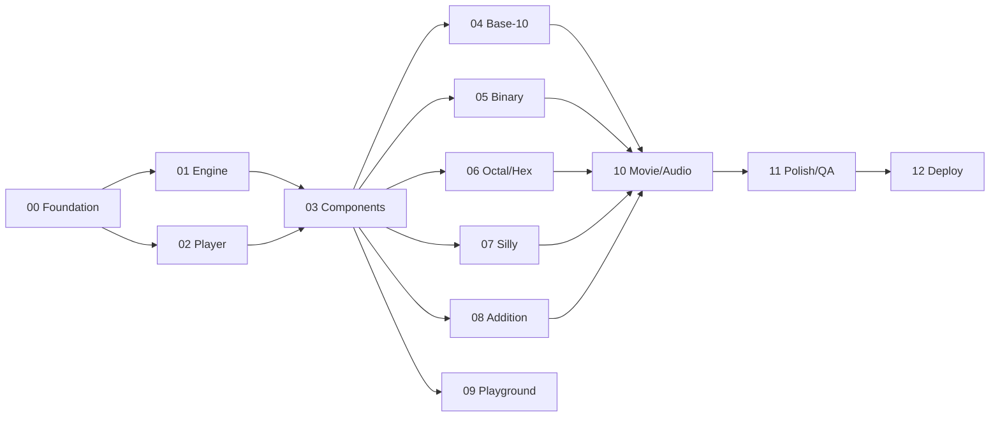

# Master Plan

## Vision

An animated, narrated "picture book that talks." A grandparent and grandchild
sit at a computer and click through short lessons. Each lesson is a series of
**scenes**. Each scene is a series of **steps**. Each step says something out
loud (with captions) and animates something on screen: fingers go up, digits roll
over, cats turn into dogs, carries hop into the next column. Every lesson ends
with a "you try it!" interactive part. A **Movie mode** plays everything
hands-free, like a video.

Audience: children of about 5–12, guided by an adult. Younger kids enjoy the
fingers, animals and colors. Older kids get binary, hex and addition.

## Architecture at a glance

```
index.html  ──loads (classic <script> tags, fixed order)──▶
  js/core/       namespace, numeral math, addition math, router, util
  js/engine/     timeline/animation helpers, narrator (speech + captions + audio files), scene player
  js/components/ SVG hands, place-value columns, digit tiles, symbol sets, odometer, column adder
  js/lessons/    one file per lesson; each registers itself with NumSys.lessons
  js/app.js      boot: builds the menu from the lesson registry, starts the router
css/             base.css (tokens, layout), components.css, lessons.css
assets/          svg/ (illustrations), audio/ (optional pre-recorded narration)
```

All rendering uses **inline SVG and DOM with CSS transitions and animations**, plus
the Web Animations API (`element.animate`). There is no canvas requirement and no frameworks.

### Module pattern (every JS file)

```js
// js/core/numeral.js
(function (NS) {
  'use strict';
  // ... implementation ...
  NS.numeral = { toDigits, fromDigits, format, parse /* ... */ };
})(typeof window !== 'undefined' ? (window.NumSys = window.NumSys || {})
                                 : (globalThis.NumSys = globalThis.NumSys || {}));
```

- One global: `NumSys`. Each file adds one sub-namespace (`NumSys.numeral`,
  `NumSys.hands`, ...).
- A file can only use namespaces from files loaded **before** it in `index.html`.
- Pure-logic files (`js/core/*`, lesson registration) must run in Node too.
  `tests/load-app.js` loads the files listed in `tests/manifest.js` in order into a DOM-less
  `vm` context.

### Lesson / scene contract (defined in Phase 2, used by Phases 4–10)

```js
NumSys.lessons.register({
  id: 'binary',                 // used in URL: #/lesson/binary
  order: 20,                    // menu order
  title: 'Binary: Counting to 1023 on Two Hands',
  shortTitle: 'Binary',
  icon: 'hands',                // key into NumSys.icons
  ageHint: '7+',
  scenes: [
    {
      id: 'intro',
      title: 'Fingers are switches',
      setup(stage, ctx) { /* build DOM/SVG into `stage`; return optional state */ },
      steps: [
        { say: 'Each finger is either up or down.', do: async (ctx) => { /* animate */ } },
        { say: 'Up means one. Down means zero.',   do: async (ctx) => { ... } },
      ],
      interactive: false,       // true = the player waits for the child; step.do may resolve on a click
      teardown(stage, ctx) {}
    },
  ],
});
```

- `say` is the narration text. Its id is `<lessonId>.<sceneId>.<stepIndex>`, which is
  also how optional pre-recorded audio files are named.
- `do(ctx)` returns a Promise. The player waits for **both** the narration and the
  animation to finish before it auto-advances (in Movie mode or with autoplay on).
- `ctx` gives: `ctx.stage`, `ctx.state`, `ctx.wait(ms)`, `ctx.speed` (playback
  rate), `ctx.reducedMotion`, `ctx.sound(name)` (sound effects), `ctx.cue(i)` (resolves when sentence i of
  `say` starts; see DECISIONS D15), and `ctx.abortSignal`.
  Animations must stop cleanly when the user skips.
- The player must be able to **jump to any step** by re-running `setup` and then
  replaying the earlier steps' `do` with animations disabled (`ctx.instant = true`).
  So every `do` must handle `ctx.instant`.

### Numeral engine contract (defined in Phase 1)

A **digit set** describes a number system:

```js
{ id: 'hex', base: 16, name: 'Hexadecimal',
  digits: [ {value:0, label:'0', speak:'zero'}, ..., {value:15, label:'F', speak:'F'} ],
  kind: 'text' | 'icon' | 'color' }   // icon/color digits carry an `icon` or `color` field
```

Core functions (pure, BigInt-safe where it matters):
`toDigits(n, base) → [most significant ... least]`,
`fromDigits(digits, base)`, `format(n, digitSet)`, `parse(str, digitSet)`,
`placeValues(n, base) → [{digit, power, value}]`,
`addSteps(a, b, base) → [{column, da, db, carryIn, sum, digit, carryOut}]` (drives the
animated column-addition), and `countSequence(from, to, base)` (for odometer animations).

## Directory layout (target)

```
index.html                 app entry (also works from file://)
css/base.css  css/components.css  css/lessons.css
js/core/namespace.js  util.js  numeral.js  digitsets.js  addition.js  router.js  lessons.js
js/engine/anim.js  sound.js  narrator.js  player.js  audio-manifest.js
js/components/icons.js  symbols.js  digit-tile.js  readout.js  odometer.js  place-value.js  column-add.js  hands.js  gallery.js
js/lessons/01-base10.js  02-binary.js  03-octal-hex.js  04-silly.js  05-addition.js  06-playground.js
js/app.js
assets/svg/  assets/audio/
tests/manifest.js  harness.js  load-app.js  specs.test.js  specs/*.spec.js  browser.html
tools/check.sh  tools/lint-rules.js  tools/smoke.js  tools/narration-export.js  tools/build-dist.sh
deploy/README.md  deploy/s3-cloudfront.sh  deploy/akamai.md  deploy/headers.md
docs/plan/...              (this plan)
```

## Phases

Each phase is **standalone**. It has its own spec file with context, tasks,
acceptance criteria, and verification steps, so a fresh session can do it
without any memory of earlier sessions.

| # | Phase | Depends on | Output |
|---|---|---|---|
| 00 | [Foundation & app shell](phases/phase-00-foundation.md) | — | Skeleton, conventions, router, menu, check script, test harness |
| 01 | [Numeral & addition engine](phases/phase-01-numeral-engine.md) | 00 | Pure math and digit sets, fully unit-tested |
| 02 | [Scene player & narration](phases/phase-02-player-narration.md) | 00 | Step player, speech and captions, controls, demo lesson |
| 03 | [Visual components](phases/phase-03-visual-components.md) | 01, 02 | SVG hands, place-value columns, tiles, odometer, animal and color symbols |
| 04 | [Lesson: Base‑10 & fingers](phases/phase-04-lesson-base10.md) | 03 | First real lesson |
| 05 | [Lesson: Binary on two hands](phases/phase-05-lesson-binary.md) | 03 | Count to 1023 on 10 fingers |
| 06 | [Lesson: Octal & Hex](phases/phase-06-lesson-octal-hex.md) | 03 | Octal, hex, hex colors |
| 07 | [Lesson: Silly systems (animals & colors)](phases/phase-07-lesson-silly.md) | 03 | Animal base‑5, color base‑3 |
| 08 | [Lesson: Addition in every system](phases/phase-08-lesson-addition.md) | 03 (+04–07 nice to have) | Animated column addition |
| 09 | [Playground & games](phases/phase-09-playground.md) | 03 | Converter, make-your-own system, quiz |
| 10 | [Movie mode & recorded audio](phases/phase-10-movie-audio.md) | 04–08 | Hands-free "video", optional voice files, optional recording |
| 11 | [Polish, accessibility, cross-browser QA](phases/phase-11-polish-qa.md) | 04–10 | Production quality |
| 12 | [Packaging & CDN deployment](phases/phase-12-deploy.md) | 11 (can run any time after 00) | `dist/`, zip, S3/CloudFront and Akamai scripts and docs |



Phases 04–09 only depend on 03, so they can run in any order. They can even run in
parallel sessions on separate branches, because each touches only its own lesson
file plus additive CSS.

## Verification strategy (all phases)

1. **Unit tests**: `node --test tests/`. These need no dependencies and cover all
   pure logic, plus "every lesson registers, every step has `say` text, and ids are unique."
2. **Static rule lint**: `tools/lint-rules.js` fails on `type="module"`, `fetch(`,
   `XMLHttpRequest`, absolute `src="/`/`href="/` paths, any `http(s)://` URL in
   runtime files, and scripts that are on disk but missing from `index.html`.
3. **Browser smoke test** (when available): load `index.html` over `file://` in a
   headless browser, visit every lesson route, and check for zero console errors.
   Playwright via `npx` is optional and is never added as a required dependency.
   If it's unavailable, follow the manual checklist in the phase file.
4. **Human check**: each phase file ends with "How to see it". The handoff note
   repeats it for the user.
